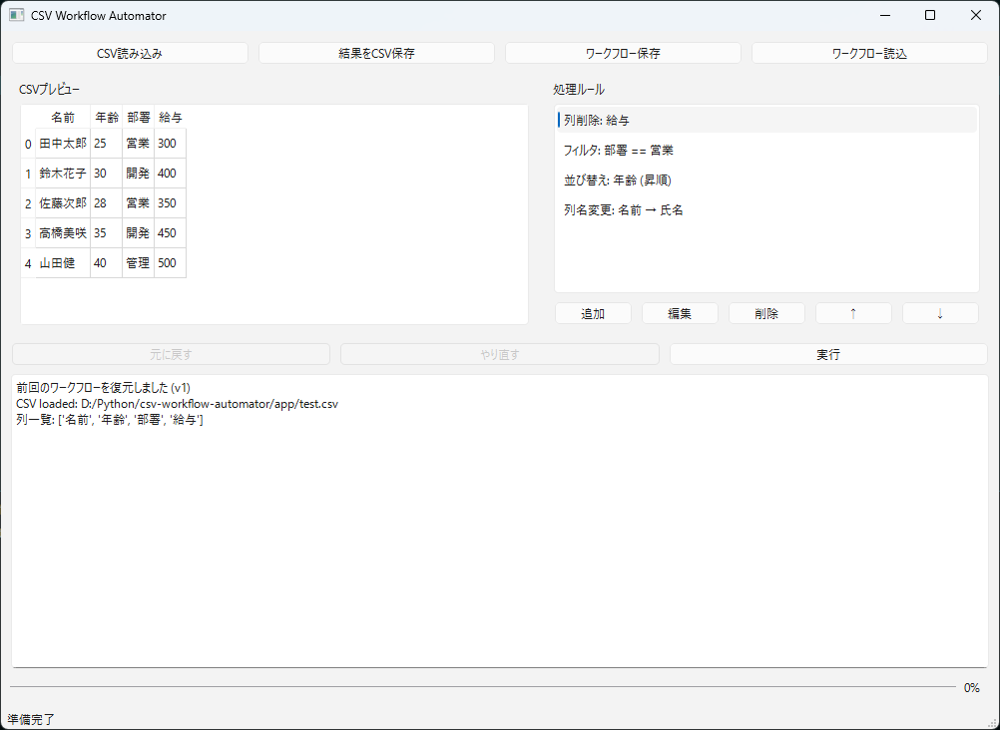

# CSV Workflow Automator

CSVファイルをGUI上で簡単に加工・処理できるPythonアプリです。  
列削除、フィルタ、並び替え、列名変更などのルールを組み合わせてワークフローとして保存・再利用できます。

---

## スクリーンショット




---

## 機能

- CSVファイルの読み込み・プレビュー
- 複数の処理ルール設定
  - 列削除
  - フィルタ（条件指定）
  - 並び替え（昇順/降順）
  - 列名変更
- ルールの並び替え、編集、削除
- ワークフローの保存・読み込み（JSON形式）
- 元に戻す / やり直す（Undo/Redo）
- 処理後の結果CSVを保存
- 実行ログと進捗バー表示

---

## 必要環境

- Python 3.10 以上
- 必要ライブラリ（`requirements.txt`に記載）:
  - pandas
  - PySide6

---

## インストール

1. 仮想環境の作成:
```bash
python -m venv .venv
```

2. 仮想環境の有効化:
```bash
.\.venv\Scripts\activate

```
3. 必要ライブラリのインストール:
```bash
pip install -r requirements.txt
```

---

## 実行方法

### GUI起動

```bash
python app/main.py
```
- CSVファイルを読み込み
- ルールを追加・編集
- 「実行」ボタンで処理を反映
- 処理結果をCSVに保存可能

### テスト用ワークフロー実行

```bash
python app/test_full_workflow.py
```
- サンプルCSV: app/test.csv
- サンプルワークフロー: app/test_workflow.json
- 処理結果をコンソールに表示

---

## ファイル構成例

```bash
app/
  main.py             # GUI起動用
  test_full_workflow.py # ワークフロー自動テスト
  test.csv            # テスト用CSV
  test_workflow.json  # テスト用ルール
core/
  ui/
    main_window.py
    rule_dialog.py
  rules/
    drop_column_rule.py
    filter_rule.py
    sort_rule.py
    rename_column_rule.py
  processor.py
  table_model.py
requirements.txt
README.md
```